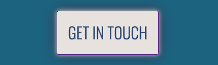

Lindi Harding - Portfolio Task

[My portfolio site]( https://Lyndallh.github.io )

## Project Requirements

### Content
I have used a profile picture of my children at the beach. It paints a picture of outdoor family fun and has my favourite colours. My biography decribes my professional development and my personal brand. My contact form sends me an email. Despit being a table and not having flex, it fits OK on a phone screen size as is it only 2 columns. I have used flex outside the table to make it look nice. My projects sections uses flex and has placeholders for suture projects and I have blended an additional projects section with links to external sites by including a 'bike blog' section, which looks like a projects section. This showcases my community volunteer active travel projects.

- [x] At least one profile picture
- [x] Biography (at least 100 words)
- [x] Functional Contact Form
- [x] "Projects" section
- [x] Links to external sites, e.g. GitHub and LinkedIn.

### Technical
I have included two web pages. One is the index and another is the contact form. In further development I would like to have new pages for each of my projects with a summary of the project. I have enjoyed understanding and practicing version control through github. I have used it to back out changes. I have used flex and media queries in all sections. I have included multiple device breakpoints. I have also used semantic hmtl where possible.

- [x] At least 2 web pages.
- [x] Version controlled with Git
- [x] Deployed on GitHub pages.
- [x] Implements responsive design principles.
- [x] Uses semantic HTML.

### Bonus (optional)
I included hover states on my navigation menu, my hyperlinked project and bike blog images. I also used it on the buttons and the 'get in touch' article that appears as a button. I am looking forward to learning Javascript in upcoming modules.

- [x] Different styles for active, hover and focus states.
- [ ] Include JavaScript to add some dynamic elements to your site. (Extratricky!)

#### Resposivity Screenshots

#### Hover Screenshots

